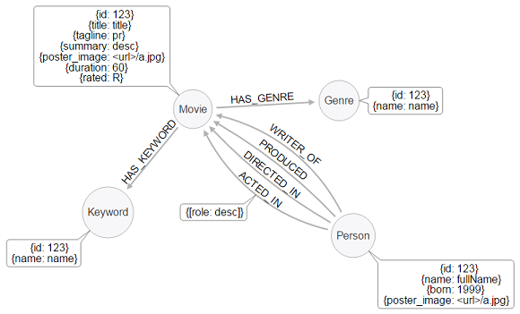

# README

This Neo4j-based node / react web app displays movie and person data in a manner similar to IMDB.  It is designed to serve as a template for further development projects.  Feel encouraged to fork and update this repo!

## The Model



### Nodes

* `Movie`
--nodes:Movie csv/movie_node.csv

* `Person`
--nodes:Person csv/person_node.csv

### Relationships

* `(:Person)-[:ACTED_IN {role:"some role"}]->(:Movie)`
--relationships:ACTED_IN csv/acted_in_rels.csv

## Database Setup

### Unix _[Video Instructions](https://youtu.be/O71B2KcTD6A)_

* [Download Neo4j Community Edition: .tar Version](https://neo4j.com/download/other-releases/)
* [video instructions start here](https://youtu.be/O71B2KcTD6A)
* Set your `NEO4J_HOME` variable: `export NEO4J_HOME=/path/to/neo4j-community`
* From this project's root directory, run the import script:

```
export NEO4J_HOME="/usr/local/Cellar/neo4j/3.3.4/libexec"
$NEO4J_HOME/bin/neo4j-import --into $NEO4J_HOME/data/databases/graph.db --nodes:Person csv/person_node.csv --nodes:Movie csv/movie_node.csv --relationships:ACTED_IN csv/acted_in_rels.csv --delimiter ";" --array-delimiter "|" --id-type INTEGER
```

If you see `Input error: Directory 'neo4j-community-3.2.5/data/databases/graph.db' already contains a database`, delete the `graph.db` directory and try again.

* Add [constraints](https://neo4j.com/docs/developer-manual/current/cypher/#query-constraints) to your database: `$NEO4J_HOME/bin/neo4j-shell < setup.cql -path $NEO4J_HOME/databases/graph.db`
* Start the database: `$NEO4J_HOME/bin/neo4j console`


### Start the Database!

* Start Neo4j if you haven't already!
* Set your username and password (You'll run into less trouble if you don't use the defaults)
* Set environment variables (Note, the following is for Unix, for Windows you will be using `set=...`)
  * Export your neo4j database username `export MOVIE_DATABASE_USERNAME=myusername`
  * Export your neo4j database password `export MOVIE_DATABASE_PASSWORD=mypassword`
* You should see a database populated with `Movie`, `Genre`, `Keyword`, and `Person` nodes.

## Node API

From the root directory of this project:

* `cd api`
* `npm install`
* `node app.js` starts the API
* Take a look at the docs at [http://localhost:3000/docs](http://localhost:3000/docs)


## Contributing

### Node.js/Express API

The Express API is located in the `/api` folder.

#### Create Endpoint

The API itself is created using the [Express web framework for Node.js](https://expressjs.com/). The API endpoints
are documented using swagger and [swagger-jsdoc](https://www.npmjs.com/package/swagger-jsdoc) module.

To add a new API endpoint there are 3 steps:

1. Create a new route method in `/api/routes` directory
2. Describe the method with swagger specification inside a JSDoc comment to make it visible in swagger
3. Add the new route method to the list of route methods in `/api/app.js`.
